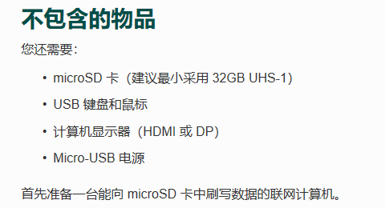

# nano和NX的介绍及配置

# 一、NVIDIA Jetson

## 1.概述

NVIDIA Jetson 是业内领先的 AI 计算平台，它面向移动嵌入式系统市场中的 GPU
加速并行处理。在深度学习和计算机视觉方面的高性能、低能耗计算，使得 Jetson
成为计算密集型嵌入式项目的理想平台。

因为该平台和PC的框架不同，所以使用过的人都会发现该平台有些很奇怪的坑，但如果用好了，该平台的性能是远大于NUC的，尤其是它在神经网络上的加速，是NUC无法比的，此外，TX1、TX2的体积和质量比NUC小很多，非常适合在对重量敏感的机器人上应用（如无人机）。


## 2.NX介绍


### 一些网站

Xavier NX 环境配置 <https://blog.csdn.net/u013963960/article/details/107360244/>

Jetson Xavier NX 烧写系统镜像
<https://blog.csdn.net/qq_41990294/article/details/108967558>

NVIDIA Jetson Xavier NX使用SD镜像刷机流程
<https://blog.csdn.net/weixin_41010198/article/details/109289438>

## 3.Nano

<https://developer.nvidia.com/zh-cn/embedded/learn/get-started-jetson-nano-devkit>
教程官网，能进去可以照着这个来，进不去也没事儿，看本文后面内容就行并且更加详细。





# 二、NX配置

## 1、下载 NX 开发板套件（SD Card Image）

首先去官网下载 JETSON XAVIER NX 开发者套件 [https://developer.nvidia.com/zh-cn/embedded/jetpack](https://link.zhihu.com/?target=https%3A//developer.nvidia.com/zh-cn/embedded/jetpack)


## 2、下载烧录工具

下载链接：[https://www.balena.io/etcher/](https://link.zhihu.com/?target=https%3A//www.balena.io/etcher/)


下载后直接安装，然后打开。

## 3、烧录 TF 卡

选择下载好的镜像


选择 sd 卡安装


烧写


等待烧写完即可

## 4、开机启动

将烧录好的 TF 卡插入到 NX
开发板上，连接好鼠标、键盘、显示器、最后连接电源（19V供电，可以用笔记本适配器，nano使用的是5V供电不可以），自动启动开发板。

之后其实就是进入类似 ubuntu 的系统安装，选择选项安装就可以了，总体步骤如下：

- 查看并接受NVIDIA Jetson软件EULA

- 选择系统语言，键盘布局和时区

- 创建用户名，密码和计算机名称（密码简单的6个1就行）

- 登录


接下来就是进行系统基础环境的配置了，包括：风扇开启、系统源、软件源、更新、中文输入法等。

联网问题：在系统安装过程中会有一个联网提示，我们可以选择联网安装系统，这样会装的慢一点，但是比较方便。

如果没有联网，则右上角连接网络，或者插网线。（注：联网后进入浏览器时可以先将浏览器默认搜索引擎设置成baidu.com）


## 5.风扇控制

###先手动开启风扇

很多开发者拿到Xavier NX时候开机，发现Xavier NX的风扇并不会自动转动，很多人都去群里或者找经销商询问是否自己的开发板坏掉了。实际上不是这样的。Xavier NX的风扇在系统内核中有一套自动控制温度和转速的算法，经过我观察大约在40度左右的时候会自动开启风扇进行散热，在核心温度大约低于39度时候会自动关闭散热风扇。Xavier NX的官方开发套件载板是和Nano通用的，因此PWM控制的指令和管脚和Nano也是通用的，完全可以通过nano的PWM指令来控制Xavier的风扇。指令通过Alt+Ctrl+T呼叫命令台（先按住Alt+Ctrl再按T），然后在命令行输入以下代码并且运行：

sudo sh -c 'echo 140 \> /sys/devices/pwm-fan/target_pwm'

这段代码中，数字位数140即代表了风扇的PWM占空比参数。其区间为0～255，0即代表了风扇完全停止，255代表了风扇火力全开。实际上在日常使用过程中我倾向于使用100～150的占空比，也就是40%～60%左右。因为过低风扇散热无力，过高了风扇噪音快赶上台式机了，听起来会比较烦人。除了重度编译，运行较大网络吃满资源，还是用不到255的占空比的。仅有的几次使用也只是为了跑官方的BenchMark基准测试进行暴力运行。需要注意的是，尽管有时候你手动开了风扇，Xavier NX的自动控温程序还是会和你抢夺控制权，你会发现开了风扇会莫名其妙的被自动关掉（自动程序识别到温度下降）。

###风扇自启动：

终端依次输入

```
cd /etc
sudo touch rc.local
sudo gedit rc.local
```

在创建的文件中添加如下：

```  
#!/bin/bash
sleep 10
sudo /usr/bin/jetson_clocks
sudo sh -c 'echo 255 > /sys/devices/pwm-fan/target_pwm'
```

赋予权限：

`sudo chmod 755 /etc/rc.local`

重启

`sudo reboot`

## 6.换源（源不行，啥都不行）
安装完系统后首先应该更新源，否则后续更新和升级会非常慢。

但是由于Jetson采用的是aarch64架构的Ubuntu 18.04.2 LTS系统，与AMD架构的Ubuntu系统不同，因此需要替换成aarch64的源，这里一定要注意，不要替换成x86-64的源了。

首先备份原本的源（备份到同一文件夹），更改source.list文件的名字，以备不时之需：

`sudo cp /etc/apt/sources.list /etc/apt/sources.list.bak `  

`sudo gedit /etc/apt/sources.list`

（注：gedit比vim好用。建议用这个。）

然后删除所有内容，复制以下内容并粘贴进去。这里最好要更换中科大（中国科学技术大学）的源：

```
deb http://mirrors.ustc.edu.cn/ubuntu-ports/ xenial main multiverse restricted universe
deb http://mirrors.ustc.edu.cn/ubuntu-ports/ xenial-backports main multiverse restricted universe
deb http://mirrors.ustc.edu.cn/ubuntu-ports/ xenial-proposed main multiverse restricted universe
deb http://mirrors.ustc.edu.cn/ubuntu-ports/ xenial-security main multiverse restricted universe
deb http://mirrors.ustc.edu.cn/ubuntu-ports/ xenial-updates main multiverse restricted universe
deb-src http://mirrors.ustc.edu.cn/ubuntu-ports/ xenial main multiverse restricted universe
deb-src http://mirrors.ustc.edu.cn/ubuntu-ports/ xenial-backports main multiverse restricted universe
deb-src http://mirrors.ustc.edu.cn/ubuntu-ports/ xenial-proposed main multiverse restricted universe
deb-src http://mirrors.ustc.edu.cn/ubuntu-ports/ xenial-security main multiverse restricted universe
deb-src http://mirrors.ustc.edu.cn/ubuntu-ports/ xenial-updates main multiverse restricted universe
```

## 7.进行更新：

```
sudo apt-get update
sudo apt-get full-upgrade
```

注：sudo的意思是管理者权限。

上述更新时间较长，中间可能由于网速的关系会更新失败，此时不要关机重新执行命令即可，会自动断点续传的。

如果因为网络问题失败了，可以尝试重新联网，然后根据提示，输入指令:


`apt-get update --fix-missing`

即可重新完成更新。

## 8.修改息屏时间

Jetson默认5分钟内不操作即会关闭屏幕，重新开启屏幕需要重新输入开机密码。由于在开发Jetson Nano的过程中经常需要等待，因此并不希望频繁的开启屏幕，而是希望屏幕一直打开。打开System Settings进入系统设置界面，如下图所所示：  
 


单击Brightness & Lock，然后将 Turn screen off when inactive for 改为 Never即可，如下图所示：


## 9.换网（这个可能不是很需要）

网关错误拦截了数据包或者防火墙故意将其屏蔽在外

（比方update 包含有google-chrome浏览器的source时候，ip会自动重定向至6.6.6.6)

所以最好进行以下操作：

`sudo vim /etc/resolv.conf`

然后输入以下内容：

nameserver 8.8.8.8

nameserver 223.5.5.5

nameserver 223.6.6.6

## 10.设置python3为默认版本

Ubuntu默认python2，但我们一般需要3，故要修改。

`sudo update-alternatives --install /usr/bin/python python /usr/bin/python2 100`

同样的方法，设置python3为默认。

`sudo update-alternatives --install /usr/bin/python python /usr/bin/python3 150`

然后可以通过如下指令进行默认python的配置：

`sudo update-alternatives --config python`

然后输入python就是python3为默认了。

## 6、Cuda环境变量配置

尽管自带cuda，但刷机进行完毕以后，还需要手动进行环境变量添加。否则你后面但凡使用cuda库的程序和代码都会因为找不到cuda而满屏幕炸错。这里我们可以使用Vim来进行环境变量写入操作。呼叫出命令台，输入以下代码：

`sudo vim \~/.bashrc`

打开环境变量文件，然后按下键盘上的字母“a”控制vim进行插入删改操作模式（纯给新手看，当年我第一次用vim也及其蒙B）然后在文件最后插入以下环境变量代码：

export PATH=/usr/local/cuda/bin:\$PATH

export LD_LIBRARY_PATH=/usr/local/cuda/lib64:\$LD_LIBRARY_PATH

export CUDA_HOME=\$CUDA_HOME:/usr/local/cuda

然后敲击键盘上的Esc按键退出编辑插入模式，输入'':wq!''用来写入环境变量并且强制退出vim。接着在命令行内刷新环境变量：

`source \~/.bashrc`

刷新环境变量以后可以通过查看nvcc版本的指令来查看是否配置好cuda相关的环境变量。新开命令行输入以下代码：

`nvcc -v`

到此cuda的环境路径已经配置完毕。

## 7、使用Jtop进行资源监视

Jtop是老外的一个Jetson开发者为Jetson系列开发的一个小App，可以通过pip安装，用来监视系统资源使用，温度等等一些关键参数，可以为你代码运行调试阶段提供一些支持，也可以查看整体的资源占用率，查看当前温度和内存使用是否处于危险的状态。开启一个新的命令行，安装命令如下：

`sudo -H pip install jetson-stats`

然后输入：

`sudo jtop`

如果一切顺利，则可以看到以下界面：


## 8.安装中文输入法

由于在开发过程中经常需要使用中文搜索以及书写必要的中文注释，所以推荐为系统安装中文输入法。Jetson Nano自带ibus中文输入法，但是要简单的配置下才能进行中文的输入。

下面为ibus下载拼音输入法，输入命令：

`sudo apt-get install ibus-pinyin`

上述下载和安装大概需要数十分钟的时间。安装完成后进入系统配置System Settings界面，选择语言支持选项Language Support ,  然后选择“添加或删除语言”界面，会系统选择语言支持，如下图所示：


此处选择“中文简体”然后单击Apply即可。这个Apply过程会安装一系列中文语言包。安装完成后在语言支持界面将汉语调整到最前面，如下图所示：


然后单击“应用到整个系统”。最后将“键盘输入法系统”改为iBus即可.

**重新启动系统！！！！**
然后在终端中输入下述命令进入ibus配置界面：

`ibus-setup`

在配置界面中单击“添加”按钮，然后展开“汉语”选项，选择Intelligent Pinyin。这里如果找不到“汉语”选项则可以先关机重启，再重新查找。


添加完成后输入下面的命令重启ibus即可。

`ibus restart`

最后，将桌面顶任务栏中将输入法切成拼音输入法Pi，如下图所示：


拼音配置完成。

## 9.Tmux安装
tmux是一个非常好用的分屏工具。

###安装

`sudo apt-get install tmux`

安装完成后直接在shell里输入

`tmux`

即可

###ctrl+b
- 意思就是在进入到 tmux 之后，先摁 `Ctrl` ，再摁 `b` ，发现进入到了 上帝模式，姑且当这种模式就是能干任何事的上帝模式，进入这个模式要干嘛？
- 比如创建新的界面，或者分割当前界面，退出当前界面都要靠这个模式。
- 所以记下这个简单的组合键， 日后会经常用它 。

###屏幕分割
- 进入**上帝模式后**，使用`%`进行屏幕的 水平分割 ，至于问我怎么竖直分割， 我不喜欢用 ，所以忘了。

分割完，要怎么在这两个窗口之间跳转呢？

- 进入**上帝模式**，摁左右方向键切换。每切换一次，都需要 重新进入 上帝模式，才能进行下一次的切换


- 要是不想要当前操作的这个分屏怎么办？
进入 **上帝模式** ， 摁 `x`，就像是右上角的叉叉一样，很好记。

###退出tmux

进入上帝模式，按`d`其实这不是退出，这叫做 断开连接 ，意味着你可以再恢复
输入`tmux a`

其他操作还可以参考： https://blog.csdn.net/qq_35843527/article/details/53470821?ops_request_misc=%257B%2522request%255Fid%2522%253A%2522163378159216780274169314%2522%252C%2522scm%2522%253A%252220140713.130102334.pc%255Fall.%2522%257D&request_id=163378159216780274169314&biz_id=0&utm_medium=distribute.pc_search_result.none-task-blog-2~all~first_rank_ecpm_v1~rank_v31_ecpm-3-53470821.pc_search_result_cache&utm_term=jetson+nano+tmux%E4%BD%BF%E7%94%A8&spm=1018.2226.3001.4187

# 三、Nano配置

## 1.硬件准备
准备nano和一张32g以上的tf卡（micro sd）。为了能够运行视频，sd卡选择u3高速卡。
系统镜像解压后就11个g左右了，之后还会有其他环境的配置，因此建议32g起步。

准备一个电脑显示器（不需要主机）及连接线；一个键盘和一个鼠标（有线无线都可）

注意：nano的电源是5V-2A的，因此不能使用笔记本的19V适配器进行供电！！最好使用专门的充电器。

## 2.镜像写入microSD卡

详见下面的NX配置。

## 3.安装和首次启动

我们在连接显示器的情况下使用nano。方式如下：

### (1).硬件安装

选择合适的适配器连接电源，使用HDMI线连接屏幕，usb插上鼠标和键盘。


### (2).启动设置


## 6.后续（可不管）


## 7.故障排除


## 8.系统环境配置