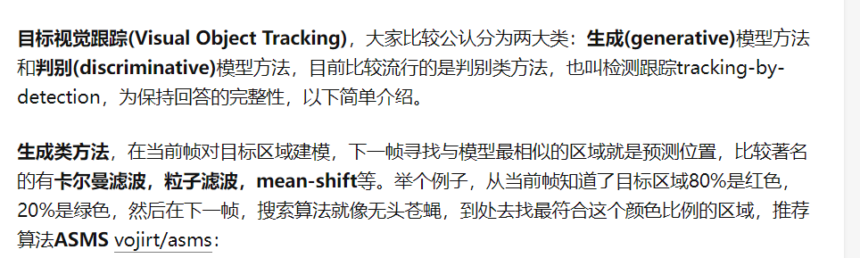

[这篇文章](https://blog.csdn.net/bemy1008/article/details/110122310)介绍了三种主流的跟踪算法，但是我看不懂，所以就记录一下。

KCF算法：
[参考详解](https://www.cnblogs.com/jins-note/p/10215511.html)

粒子滤波：解释就是说卡尔曼滤波的两个要求：系统噪声符合高斯分布，线性系统。然后粒子滤波就是应对非线性非高斯模型的，一定程度上算是卡尔曼的拓展。

meanshift算法：就是先选定，然后有点像模板匹配一样，给你找相近的。之前看到过一个是全局视野的，就是先看全局视野，然后有东西动就会生成个mask，动的时白色的。但是这个没预测。

[opencv里支持内置的8种跟踪算法](https://blog.csdn.net/weixin_38907560/article/details/82292091)，记录在这里两个原因，一个是[这个人](https://blog.csdn.net/qq_42237381/article/details/114662937)最近（21）的项目用的csrt就是基于它的，据说精度还可以。一个是想着有基础做着快。

csk算法：走的是相关滤波，据说帧率贼高。

[这个](https://blog.csdn.net/Cl2212/article/details/112413483)是论文集，好家伙不会。

[这](https://www.zhihu.com/question/26493945)是一篇综述，按照时间来的，总结了一下，相关滤波的特点就是快（从MOSSE(615)到 CSK(362) 再到 KCF(172FPS), DCF(292FPS), CN(152FPS), CN2(202FPS)提升了性能降低了帧率），准确度也挺高，但是，不适合快速运动的（辣眼睛.jpg，这总结在老后边）
[vot2016](https://link.zhihu.com/?target=http%3A//votchallenge.net/vot2016/trackers.html)推荐的是[staple算法](https://link.zhihu.com/?target=http%3A//www.robots.ox.ac.uk/~luca/staple.html)，方法是结合相关滤波和颜色。
